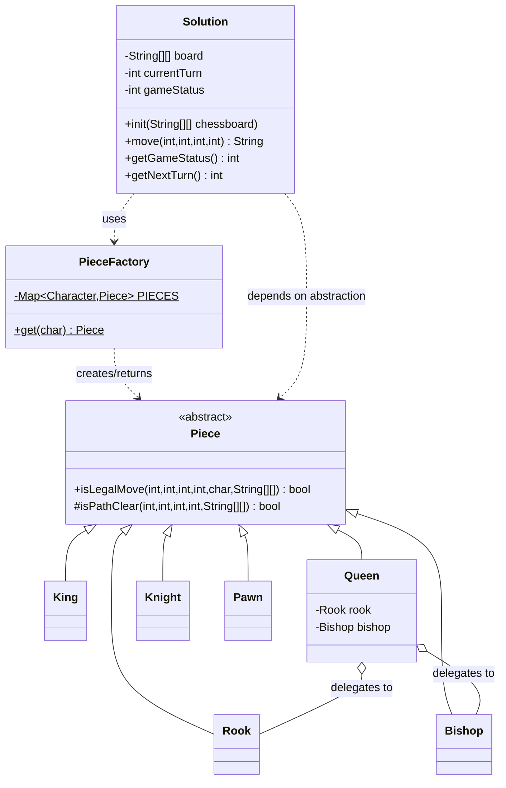

# Chess — Low Level Design

## Class Diagram



---

## Problem Statement

8×8 chess game between two players. White pieces start at rows 0–1, black at rows 6–7.

```
Row 0: WR WH WB WQ WK WB WH WR
Row 1: WP WP WP WP WP WP WP WP
Row 2-5: (empty)
Row 6: BP BP BP BP BP BP BP BP
Row 7: BR BH BB BQ BK BB BH BR
```

Piece codes: `K`=King, `Q`=Queen, `R`=Rook, `B`=Bishop, `H`=Knight, `P`=Pawn.
First character is colour (`W`/`B`), second is type.

## API

```java
void   init(String[][] chessboard)
String move(int startRow, int startCol, int endRow, int endCol)
int    getGameStatus()   // 0=in progress, 1=white won, 2=black won
int    getNextTurn()     // 0=white, 1=black, -1=game over
```

`move()` returns `"invalid"` on rule violation, `""` on non-capturing move, or the captured piece string (e.g. `"BK"`, `"WP"`) on a capture. Game ends when a King is captured.

---

## Entities

```
String[][]    board       — "" for empty, "WR"/"BP"/... for occupied
Solution      — owns board state, turn, game status; validates + executes moves
Piece         — abstract base; each subclass owns the move rules for one piece type
King/Queen/Rook/Bishop/Knight/Pawn — concrete strategies
PieceFactory  — flyweight map; one stateless Piece instance per type character
```

---

## Key Design Decisions

### 1. Board as String[][] — piece type encoded in the string

Each cell holds a two-character string (`""` for empty, e.g. `"WR"`, `"BP"`).
- `charAt(0)` = colour (`W`/`B`)
- `charAt(1)` = type (`K`/`Q`/`R`/`B`/`H`/`P`)

Parsing is O(1). The board is the single source of truth — no need to maintain a parallel piece-object map.

### 2. Factory Pattern — `PieceFactory` + abstract `Piece`

```java
// Solution.move() — one line, no switch, no if/else:
PieceFactory.get(type).isLegalMove(r1, c1, r2, c2, color, board)
```

`PieceFactory` holds a `Map<Character, Piece>` of stateless flyweight instances — one per type, created once at class-load. `Solution` depends only on the `Piece` abstraction (DIP). Adding a new piece type requires a new class + one factory line; `Solution` is never touched (OCP).

### 3. SOLID principles applied

| Principle | How |
|-----------|-----|
| **S** — Single Responsibility | Each piece class owns exactly one piece's movement logic |
| **O** — Open/Closed | New piece = new class + one factory entry; `Solution` unchanged |
| **L** — Liskov Substitution | Any `Piece` subclass substitutes without breaking `Solution` |
| **I** — Interface Segregation | `Piece` exposes one method — no fat interface |
| **D** — Dependency Inversion | `Solution` depends on `Piece` abstraction, not on `King`/`Rook`/... directly |

### 4. Queen composition over duplication

```java
class Queen extends Piece {
    private final Rook   rook   = new Rook();
    private final Bishop bishop = new Bishop();

    boolean isLegalMove(...) {
        return rook.isLegalMove(...) || bishop.isLegalMove(...);
    }
}
```

Queen = Rook ∪ Bishop. Delegation reuses both validators with zero code duplication.

### 5. `isPathClear` lives in the abstract base class

Rook, Bishop, and Queen all need path checking. The method is `protected` in `Piece` so all three subclasses inherit it without any utility class or duplication. Knight never calls it (jumps over pieces).

### 6. Validation before mutation

All checks run before any board state is modified. If any check fails, `"invalid"` is returned without touching the board. Only one positive path reaches step 8 (execute).

### 7. Turn and status are simple integers

`currentTurn` (0/1) and `gameStatus` (0/1/2) are the minimum state needed. Flip: `1 - currentTurn`.

---

## Move Validation — Per Piece

### King
```
|rowDiff| ≤ 1  AND  |colDiff| ≤ 1
```
1 step in any of 8 directions. Same-square exclusion is handled upstream in `Solution.move()`.

### Knight (H)
```
(|dr| == 2 AND |dc| == 1)  OR  (|dr| == 1 AND |dc| == 2)
```
L-shape. The **only piece that can jump over others** — no `isPathClear` needed.

### Rook
```
r1 == r2  OR  c1 == c2       (same row or column)
AND isPathClear(r1,c1, r2,c2)
```

### Bishop
```
|r2 - r1| == |c2 - c1|       (strict diagonal)
AND isPathClear(r1,c1, r2,c2)
```

### Queen
```
rook.isLegalMove(...)  OR  bishop.isLegalMove(...)
```

### Pawn
```
forward = +1 for white (toward row 7), -1 for black (toward row 0)

Non-capture: dr == forward AND dc == 0  AND  destination is empty
Capture:     dr == forward AND |dc| == 1  AND  destination has an opponent piece
```
Pawn is the only piece whose validity depends on whether the destination is empty or occupied — opposite rules for the two move types.

---

## `isPathClear` — Shared Sliding-Piece Helper

Defined as `protected` in `Piece`; inherited by Rook, Bishop, Queen.

```
dr = signum(r2 - r1)    // step direction: -1, 0, or +1
dc = signum(c2 - c1)

walk from (r1+dr, c1+dc) up to but excluding (r2, c2):
    if any square is non-empty → return false
return true
```

Works for horizontal (dr=0, dc=±1), vertical (dr=±1, dc=0), and diagonal (dr=±1, dc=±1) paths.

---

## Validation Order in `move()`

1. Game already over? → `"invalid"`
2. Coordinates in bounds? → `"invalid"`
3. Start == end? → `"invalid"`
4. Piece at source? → `"invalid"`
5. Piece belongs to current player? → `"invalid"`
6. Destination not occupied by own piece? → `"invalid"`
7. `PieceFactory.get(type).isLegalMove(...)` fails? → `"invalid"`
8. Execute: update board, detect King capture, switch turn

Each check is a fast-fail. Only one positive path reaches step 8.

---

## Game-End Detection

After every valid move, check if the captured piece is a King:

```java
if (!captured.isEmpty() && captured.charAt(1) == 'K')
    gameStatus = (currentTurn == 0) ? 1 : 2;
```

`getGameStatus()` and `getNextTurn()` read `gameStatus` — O(1).

---

## Complexity

| Operation | Time | Notes |
|-----------|------|-------|
| `init` | O(64) = O(1) | Copy 8×8 board |
| `move` (validation) | O(8) = O(1) | Path check ≤ 7 squares |
| `move` (execution) | O(1) | Two array writes |
| `getGameStatus` | O(1) | Integer read |
| `getNextTurn` | O(1) | Integer read |
| `PieceFactory.get` | O(1) | HashMap lookup |

Space: O(64) = O(1) for the board. O(6) for the flyweight piece instances.

---

## Simplified Rules (out of scope)

The following standard chess rules are **intentionally excluded**:
- **Check / Checkmate** — King in check must move; game ends only on actual capture here.
- **Castling** — King + Rook special move requiring move-history tracking.
- **En passant** — Pawn capture requiring move-history tracking.
- **Pawn promotion** — Pawn reaching the last rank becomes a Queen (needs board mutation + piece creation).
- **Stalemate** — No legal moves available but King is not in check.
