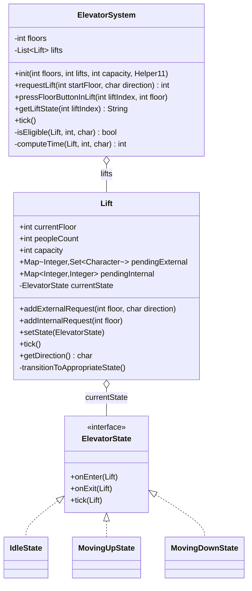

# Elevator System — Low Level Design

## Class Diagram



---

## Problem Statement

A building has `F` floors (0-indexed) and `L` elevators each with a fixed passenger capacity. Passengers can call a lift from any floor (external request) specifying their desired direction (Up/Down), and once inside press a floor button (internal request). The system must dispatch the nearest eligible lift to each external request.

## API

```java
void   init(int floors, int lifts, int liftsCapacity, Helper11 helper)
int    requestLift(int startFloor, char direction)        // returns assigned lift index, or -1
void   pressFloorButtonInLift(int liftIndex, int floor)
String getLiftState(int liftIndex)                        // "currentFloor-direction-peopleCount"
void   tick()                                             // advance all lifts by one floor
```

`direction` is `'U'` (up) or `'D'` (down).
`getLiftState` direction is `'U'`, `'D'`, or `'I'` (idle).

---

## Entities

```
ElevatorSystem   — orchestrator; dispatches lifts, delegates tick
Lift             — state machine; owns pending stop maps and passenger count
ElevatorState    — interface with onEnter / onExit / tick hooks
IdleState        — no-op tick; lift sits still
MovingUpState    — increments floor each tick; processes stops; reverses or idles when done
MovingDownState  — decrements floor each tick; processes stops; reverses or idles when done
pendingExternal  — Map<floor, Set<direction>>: floors where a passenger is waiting
pendingInternal  — Map<floor, count>: floors passengers inside the lift want to go to
```

---

## Key Design Decisions

### 1. State Pattern for Lift FSM

The lift's movement behaviour changes based on direction. Rather than a direction enum + if/else in `tick()`, the State Pattern encapsulates each behaviour:

| State | `tick()` action |
|-------|----------------|
| `IdleState` | Does nothing |
| `MovingUpState` | `currentFloor++`, serves stops, transitions when no more up stops |
| `MovingDownState` | `currentFloor--`, serves stops, transitions when no more down stops |

`setState()` calls `onExit` then `onEnter`, allowing lifecycle hooks without coupling.

### 2. Two separate stop maps

| Map | Key | Value | Purpose |
|-----|-----|-------|---------|
| `pendingExternal` | floor | `Set<char>` (direction) | Waiting passengers outside; direction retained for eligibility |
| `pendingInternal` | floor | count | Destination floors of passengers already inside |

External stops don't carry a passenger count because `peopleCount` is only incremented in `addInternalRequest()` (when someone boards and presses a floor button). External stops are removed when the lift arrives — the boarding happens implicitly.

### 3. `transitionToAppropriateState` — called after every new request

Any time a new external or internal request is added, the lift re-evaluates its direction:

```
hasUp  = any pending stop above currentFloor
hasDown = any pending stop below currentFloor

if neither  → Idle
if only up  → MovingUp
if only down → MovingDown
if both     → keep current state (already moving); if Idle default to MovingUp
```

This keeps the lift in the correct state without needing a separate scheduler.

### 4. Dispatch: `isEligible` + `computeTime`

`requestLift` scores every lift against the request floor and picks the one with lowest travel time:

**Eligibility rules (`isEligible`):**
- Idle → always eligible
- Moving away (already passed the floor) → ineligible
- Has no stops in current direction → will reverse, so eligible
- Has internal stops in direction:
  - Request direction must match
  - Request floor must be within the farthest internal stop
- Has only external stops in direction:
  - If all agree on one eventual direction, request must match and be within the farthest stop
  - If mixed directions, treat as internal case

**Time simulation (`computeTime`):**
Simulates floor-by-floor movement through all existing stops plus the new request floor, counting steps until it reaches `startFloor`. Accounts for direction reversal at end-of-run.

### 5. SOLID principles applied

| Principle | How |
|-----------|-----|
| **S** | Each state class owns only one direction's movement behaviour |
| **O** | New states (e.g. `DoorOpenState`) added without modifying `Lift` |
| **L** | Any `ElevatorState` substitutes without breaking `Lift.tick()` |
| **I** | `ElevatorState` interface has three focused methods; nothing extraneous |
| **D** | `Lift` depends on `ElevatorState` abstraction, not on concrete states |

---

## Movement Logic (inside `MovingUpState.tick`)

```
currentFloor++

if pendingExternal contains floor → remove (passengers board)
if pendingInternal contains floor → peopleCount -= count; remove (passengers alight)

if no pending stops above currentFloor:
    if pending stops below → setState(MovingDownState)
    else                   → setState(IdleState)
```

`MovingDownState.tick` is symmetric with `currentFloor--` and checks below.

---

## Eligibility — Edge Cases

| Situation | Decision |
|-----------|----------|
| Lift is idle at the request floor | Eligible; `computeTime` returns 0 |
| Lift moving up, request is below current floor | Ineligible (already passed) |
| Lift moving up with only external up-stops ahead, request wants to go down | Ineligible |
| Lift has no stops in its current direction | Eligible (will reverse) |
| Multiple lifts tied on time | First one found wins (implementation uses `<`, not `≤`) |

---

## Complexity

| Operation | Time | Notes |
|-----------|------|-------|
| `requestLift` | O(L × (S + F)) | L lifts; S stops for eligibility; F floors for time simulation |
| `pressFloorButtonInLift` | O(S) | Update map + transitionToAppropriateState |
| `tick` | O(L × S) | Each lift scans its pending stop maps |
| `getLiftState` | O(1) | Field reads |

S = number of pending stops per lift (bounded by number of floors F).

Space: O(L × F) for the stop maps in the worst case.

---

## Simplified Rules (out of scope)

- **Capacity enforcement** — capacity field exists but `addInternalRequest` does not reject requests when the lift is full.
- **Door open / close delay** — no tick cost for stopping at a floor.
- **Simultaneous boarding and alighting** — external pickup and internal dropoff on the same floor are both resolved in the same tick.
- **Priority queuing** — no VIP or emergency floors.
