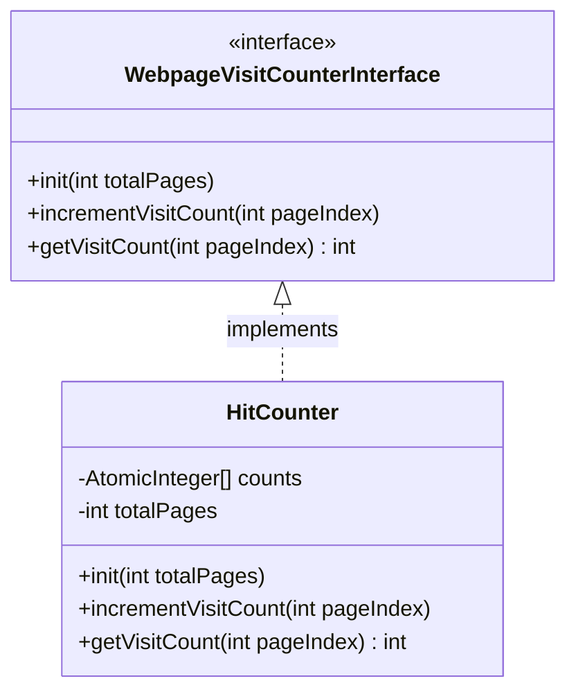

# HitCounter — Low Level Design

## Class Diagram

---

## Problem: Multi-Threaded Hit Counter (Webpage Visits Counter)

### Problem Statement

Design a low-level hit counter for a website with `n` webpages (numbered `0` to `n-1`). Hundreds of users may visit pages concurrently. You need to record visit counts for each page and return them when requested.

**Constraints:**
- At most 1000 webpages.
- For Java, the code will be tested in a **multi-threaded environment** – use thread-safe data structures and handle synchronization properly.
- For Python, the code would be tested in a single-threaded environment (not our focus here).
- There is a helper object `Helper06` with logging methods that must be used for printing logs; otherwise logs will not be visible.

**Methods to implement:**

1. `init(int totalPages, Helper06 helper)`
    - Initialize instance variables. `totalPages` is the number of webpages.
    - Use the helper for logging.

2. `incrementVisitCount(int pageIndex)`
    - Increment the visit count for the webpage at `pageIndex` by 1.

3. `getVisitCount(int pageIndex)`
    - Return the total visit count for the given page.

**Note:** For the same `pageIndex`, `incrementVisitCount()` and `getVisitCount()` will **never** be called concurrently. This ensures eventual consistency and simplifies the design.

---

## Solution Approach

### Key Design Decisions

1. **Data Structure**: An array of `AtomicInteger` (size = `totalPages`).
    - Provides O(1) access per page.
    - `AtomicInteger` offers thread-safe atomic increments and reads without explicit locking.
    - Since `getVisitCount` and `incrementVisitCount` for the same page are never concurrent, we could technically use plain `int` with `volatile` or synchronized blocks, but `AtomicInteger` elegantly handles concurrent increments from multiple threads without blocking.

2. **Concurrency Handling**:
    - Each page's counter is independent, so no contention across different pages.
    - `AtomicInteger.incrementAndGet()` uses CAS (compare-and-swap) under the hood, ensuring atomic updates with low overhead.
    - Memory visibility is guaranteed by the `AtomicInteger` (it establishes a happens-before relationship between increments and subsequent reads).

3. **Logging**: All logs are routed through the provided `helper` instance as required. We log initialization, each increment, each query, and any errors (e.g., invalid index). This aids debugging and meets the problem's requirement.

4. **Defensive Checks**: Even though input validity may be assumed, we include bounds checking to prevent `ArrayIndexOutOfBoundsException`. If an invalid index is provided, we log an error and throw an `IllegalArgumentException`. This reflects production-quality code.

5. **Initialization**: The array of `AtomicInteger` is created and populated with zero-initialized counters in the `init` method. This method is expected to be called once before any concurrent access.

### Complexity Analysis

- **Time**:
    - `incrementVisitCount`: O(1)
    - `getVisitCount`: O(1)
- **Space**: O(n) where `n` ≤ 1000 (negligible).

### Thread Safety Explanation

- `AtomicInteger` guarantees that each increment is atomic and visible to other threads.
- Because `getVisitCount` and `incrementVisitCount` for the same page are never concurrent, we don't need to worry about read-write conflicts on a single page. However, multiple increments on the same page can happen concurrently, and `AtomicInteger` handles that correctly.
- Different pages are independent, so no cross-page synchronization is needed.
- The array reference is safely published because it's written in `init` before any threads start accessing the object (assuming `init` is called in a single-threaded setup before concurrent usage).
- The solution is lock-free and scalable for hundreds of concurrent users.

### Potential Enhancements (for discussion)

- **If contention were extremely high**, we might consider `LongAdder` (from `java.util.concurrent.atomic`) which further reduces contention by maintaining a set of variables that are summed on read. However, `AtomicInteger` is simpler and sufficient for ≤1000 pages and hundreds of users.
- **If we needed to support resetting counters** or snapshotting all counts, we could add methods, but they are not required here.
- **If the `init` method could be called multiple times concurrently**, we would need to add synchronization (e.g., `AtomicReference` for the array) to ensure safe publication, but that scenario is not indicated.
