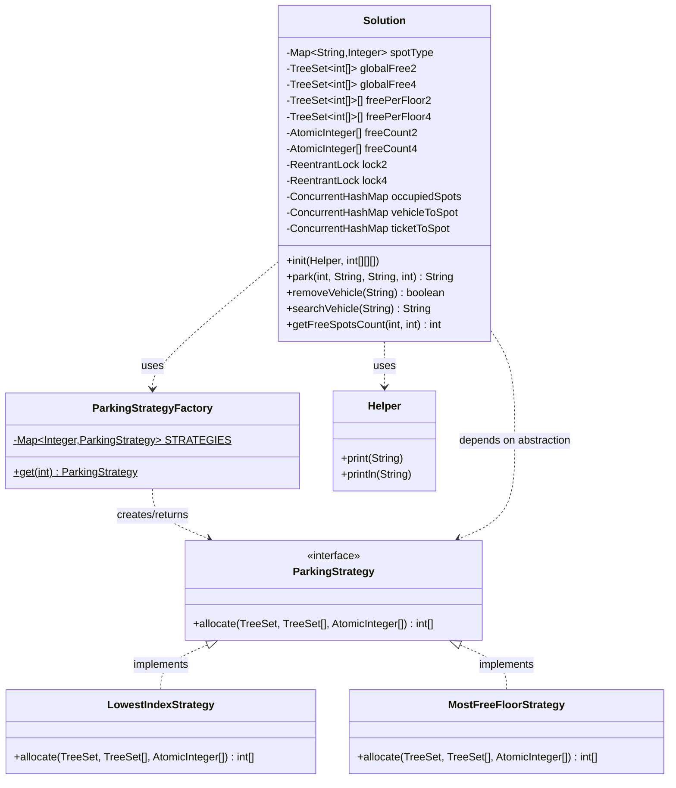

# Parking Lot — Low Level Design

## Problem Statement

Multi-floor parking lot with 2-wheeler and 4-wheeler spots. Implement:

```java
void   init(Helper helper, int[][][] parking)
String park(int vehicleType, String vehicleNumber, String ticketId, int parkingStrategy)
boolean removeVehicle(String spotId)
String  searchVehicle(String query)
int     getFreeSpotsCount(int floor, int vehicleType)
```

## Constraints

- 1 ≤ floors ≤ 5, 1 ≤ rows × cols ≤ 10,000 → max **50,000 spots** total
- `spotId` format: `"floor-row-col"` (0-indexed)
- Vehicle types: 2 (two-wheeler), 4 (four-wheeler)
- Parking strategies: 0 = lowest global index, 1 = most-free-spots floor

---

## Class Diagram



---

## Entities

```
ParkingSpot  : (floor, row, col, vehicleType)  — key is "floor-row-col"
ParkingFloor : set of spots + free counts per type
Solution     : top-level class; owns all state and implements all operations
```

---

## Data Structures

| Structure | Type | Purpose |
|-----------|------|---------|
| `spotType` | `HashMap<String, Integer>` | spotId → vehicle type (2 or 4); immutable after init; O(1) lookup during removeVehicle |
| `globalFree2 / globalFree4` | `TreeSet<int[]>` (sorted by floor,row,col) | Strategy-0: `pollFirst()` gives globally lowest-index free spot; O(log N) |
| `freePerFloor2/4[f]` | `TreeSet<int[]>[]` per floor | Strategy-1: `pollFirst()` gives lowest spot on chosen floor; O(log N_f) |
| `freeCount2/4[f]` | `AtomicInteger[]` per floor | Strategy-1 floor selection in O(F); also answers `getFreeSpotsCount` in O(1) |
| `lock2 / lock4` | `ReentrantLock` | One lock per vehicle type; guards TreeSets + counts atomically |
| `occupiedSpots` | `ConcurrentHashMap<String, String[]>` | spotId → [vehicleNumber, ticketId]; written after lock is held |
| `vehicleToSpot` / `ticketToSpot` | `ConcurrentHashMap<String, String>` | O(1) search by vehicle number or ticket |

### Why TreeSet over PriorityQueue

`TreeSet.pollFirst()` is O(log N) and supports both `pollFirst()` (Strategy-0) and `remove(specific spot)` (needed when booking via Strategy-1 and cleaning up `globalFree`). A `PriorityQueue` does not support O(log N) arbitrary removal — its `remove(obj)` is O(N).

### Why separate per-type structures (not a shared pool)

Two-wheelers and four-wheelers never share spots. Keeping them in separate TreeSets and separate locks means:
- No cross-type filtering needed inside the data structures
- Two-wheeler operations and four-wheeler operations never block each other — full concurrency between types

---

## Booking Algorithms

### Strategy 0 — Lowest Global Index

Goal: return the spot with the smallest `(floor, row, col)` across all floors.

```
lock(type)                                    // critical section begin
  spot = globalFree.pollFirst()               // O(log N) — smallest spot globally
  if spot == null → return ""                 // lot is full for this type
  freePerFloor[spot.floor].remove(spot)       // O(log N_f) — keep per-floor set consistent
  freeCount[spot.floor]--
  record vehicle in occupiedSpots, vehicleToSpot, ticketToSpot
unlock
return spotId
```

All three mutations (poll globalFree, remove from freePerFloor, decrement freeCount) happen inside one lock acquisition, so no thread can observe a partially-updated state.

### Strategy 1 — Floor With Most Free Spots (tie: lowest floor)

Goal: find the floor with the most free spots, then return its lowest-index available spot.

```
lock(type)                                    // critical section begin
  bestFloor = -1, maxFree = 0
  for f in 0..numFloors-1:                    // O(F), F ≤ 5 → effectively O(1)
      if freeCount[f] > maxFree:
          maxFree = freeCount[f]; bestFloor = f
  if bestFloor == -1 → return ""              // lot is full

  spot = freePerFloor[bestFloor].pollFirst()  // O(log N_f) — lowest spot on best floor
  globalFree.remove(spot)                     // O(log N) — keep global set consistent
  freeCount[bestFloor]--
  record vehicle
unlock
return spotId
```

`floorWithMostFreeSpots` is called **inside** the lock, so the `freeCount` values it reads are always consistent with the TreeSet state — no thread can modify them concurrently.

---

## removeVehicle — Concurrency Detail

```
record = occupiedSpots.remove(spotId)   // atomic ConcurrentHashMap op — outside any lock
if record == null → return false        // not occupied (or concurrent double-remove)

remove from vehicleToSpot, ticketToSpot

lock(type)
  globalFree.add(spot)                  // restore to both TreeSets
  freePerFloor[floor].add(spot)
  freeCount[floor]++
unlock
return true
```

`ConcurrentHashMap.remove(key)` is atomic. If two threads race to unpark the same spot, exactly one gets a non-null record; the other sees `null` and returns `false` safely — without ever acquiring the type lock. This means the type lock is never held to "protect" the ConcurrentHashMap, keeping the critical section minimal.

---

## searchVehicle

`ConcurrentHashMap.get()` needs no lock — it provides thread-safe reads natively. The method first checks `vehicleToSpot`, then `ticketToSpot`. Returns `""` if no active parking is found.

> **Design note:** `searchVehicle` returns the *current active* spotId only. A vehicle that has been unparked will return `""`. To support historical lookup ("where was vehicle X last parked?"), add a separate `latestSpot: ConcurrentHashMap` that is written on `park` but never deleted on `removeVehicle`.

---

## getFreeSpotsCount

Reads `AtomicInteger.get()` — a volatile read; always returns a currently-visible value. No lock is needed. A count that is momentarily one step behind is inherently acceptable for a "how many free spots?" snapshot — this is true in any concurrent system.

---

## Complexity

| Method | Time | Space |
|--------|------|-------|
| `init` | O(N log N) | O(N) — N spots inserted into TreeSets |
| `park` (strategy 0) | O(log N) | — |
| `park` (strategy 1) | O(F + log N) = O(log N) | — |
| `removeVehicle` | O(log N) | — |
| `searchVehicle` | O(1) | — |
| `getFreeSpotsCount` | O(1) | — |

N = total spots of given type (≤ 50,000), F = floors (≤ 5)

---

## Thread Safety Summary

| Concern | Mechanism |
|---------|-----------|
| Two threads booking the same type simultaneously | `ReentrantLock` per type — check + poll + decrement is one atomic unit |
| Two threads booking different types | Two separate locks — never contend |
| Two threads unparking the same spot | `ConcurrentHashMap.remove` is atomic; only one thread gets the record |
| `getFreeSpotsCount` racing with park/remove | `AtomicInteger` volatile read — always sees a consistent value |
| Search racing with park/remove | `ConcurrentHashMap` thread-safe reads; worst case: returns `""` for a booking in-flight |

---

## Potential Enhancements

- **`LongAdder` for `freeCount`**: Reduces write contention under extreme booking throughput. Trade-off: slower reads (sums across cells). `AtomicInteger` is sufficient here.
- **Per-floor locks instead of per-type**: If one vehicle type dominates, splitting further by floor reduces contention. Adds complexity to cross-floor `globalFree` updates.
- **Reservation timeout**: In production, a spot is typically reserved (held but not yet paid) before confirmation. Requires a `ScheduledExecutorService` to release timed-out reservations.
- **Persistent search history**: Maintain a `latestSpot` map (write-only on `park`, never deleted) so `searchVehicle` can return historical data even after removal.
