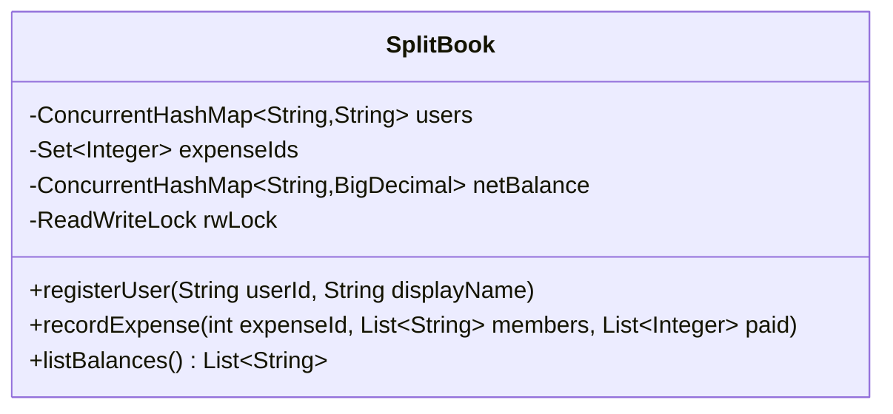

# Splitwise — Low Level Design

## Class Diagram



No additional classes are needed. A single class owns all state and exposes the three operations. A class hierarchy or Strategy pattern would add ceremony without value — the only varying behaviour is the matching algorithm inside `listBalances`, which is a single private method.

---

## Problem Statement

Track how much each person owes or is owed after group expenses are split evenly. The system maintains net balances and exposes operations to add users, record expenses, and list simplified debtor-to-creditor balances.

**Constraints:**
- 1 ≤ users ≤ 50,000
- 1 ≤ members per expense ≤ 100
- 0 ≤ paid[i] ≤ 1,000,000,000 (at least one > 0 per expense)
- All `userIds` in an expense are guaranteed to be registered
- `expenseId` values are guaranteed unique

---

## Core Idea — Net Balance

Instead of storing every pairwise debt (O(N²) space), maintain a single **net balance per user**:

```
netBalance[user] = sum of (paid[i] - fairShare) across all expenses they joined
```

- Positive → user is owed money (creditor)
- Negative → user owes money (debtor)

When two users owe each other across different expenses, the debts automatically cancel in the net balance — this is the "full internal netting" the problem asks for.

---

## Data Structures

| Structure | Type | Purpose |
|-----------|------|---------|
| `users` | `ConcurrentHashMap<String, String>` | userId → displayName; `putIfAbsent` for idempotent registration |
| `expenseIds` | `ConcurrentHashMap.newKeySet()` | Duplicate expense guard; `.add()` is atomic |
| `netBalance` | `ConcurrentHashMap<String, BigDecimal>` | Net balance per user; `merge()` for atomic per-key update |
| `rwLock` | `ReentrantReadWriteLock` | Write lock: multi-key atomic update; Read lock: consistent snapshot |

### Why BigDecimal over double

`double` accumulates rounding error across thousands of expenses:
- `0.1 + 0.2 == 0.30000000000000004` in floating point
- With 50,000 users and many expenses, drift compounds into visible cent errors

`BigDecimal` with `RoundingMode.HALF_UP` and `scale=2` gives exact monetary arithmetic.

---

## Rounding Strategy

For an expense with total `T` split among `n` members:

```
share      = T / n, rounded to 2dp (HALF_UP) — applied to members[1..n-1]
firstShare = T - share × (n-1)               — absorbs rounding remainder
```

This guarantees `sum(all shares) == T` exactly. Example: T=100, n=3:
- `share = 33.33`, `firstShare = 100 - 66.66 = 33.34`
- Sum = 33.34 + 33.33 + 33.33 = 100.00 ✓

---

## `listBalances` Algorithm

**Step 1** — Separate users into debtors and creditors from the net balance snapshot.

**Step 2** — Sort both groups lexicographically via `TreeMap`.

**Step 3** — Greedy matching: for each debtor (in order), drain against creditors (in order):

```
for debtor in debtors (sorted):
    remaining = debtor's balance
    for creditor in creditors (sorted):
        if remaining == 0: break
        transfer = min(remaining, creditor.available)
        emit "debtor owes creditor: transfer"
        creditor.available -= transfer
        remaining -= transfer
```

**Why greedy works here:** Each unit of debt is transferred exactly once. Since we process debtors and creditors in the same sorted order as the required output, the result list is naturally in (debtor, creditor) order. An explicit sort at the end guarantees correctness.

**Complexity:** O(D × C) matching where D = debtors, C = creditors ≤ N. In practice D + C ≤ N and each creditor's balance drains to zero at most once, giving O(N) amortised transfer operations.

---

## Validation Order in `recordExpense`

1. `expenseIds.add(expenseId)` returns false → duplicate → ignore
2. Any member not in `users` → ignore
3. Compute shares, acquire write lock, update all balances atomically

---

## Thread Safety

| Concern | Mechanism |
|---------|-----------|
| Two threads registering the same user | `ConcurrentHashMap.putIfAbsent` — exactly one thread inserts |
| Two threads submitting the same expenseId | `ConcurrentHashMap.newKeySet().add()` — atomic; only one wins |
| Two threads recording different expenses simultaneously | Per-key `merge` inside write lock — all balance updates atomic as a group |
| `listBalances` racing with `recordExpense` | Read lock takes a consistent snapshot before any matching |
| `getFreeSpotsCount`-style reads (none here) | Not needed — `listBalances` always snapshots first |

---

## Complexity

| Operation | Time | Space |
|-----------|------|-------|
| `registerUser` | O(1) | O(1) |
| `recordExpense` | O(n) — n = members | O(1) per user |
| `listBalances` | O(N log N) — N = active users | O(N) for snapshot + matching state |

Total space: O(U + E) where U = users ≤ 50,000 and E = distinct expense IDs recorded.

---

## Potential Enhancements

- **Unequal splits**: add a `splitType` parameter (EQUAL / EXACT / PERCENT) and a `List<BigDecimal> shares` override.
- **Expense history / audit**: maintain a `List<Expense>` for replay/undo.
- **Minimum transactions (NP-hard)**: the greedy approach gives correct results but not always the minimum number of transactions. For ≤ 100 participants per expense, exact minimisation (Subset-Sum based) is feasible.
- **Currency support**: tag each expense with a currency code; convert to a base currency on read using stored exchange rates.
